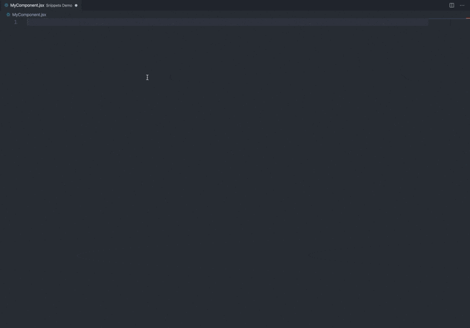

# VS Code React and Redux Snippets

This extension provides you React snippets for [VS Code](https://code.visualstudio.com/)

## Supported languages (file extensions)

- JavaScript (`.js`)
- JavaScript React (`.jsx`)
- TypeScript (`.ts`)
- TypeScript React (`.tsx`)

## 📖 Snippets List

💡*Tip: You can use the "insert snippet" action to find snippets: <kbd>command+shift+p</kbd>/<kbd>ctrl+shift+p</kbd> -> `Insert Snippet` -> type to search*

#### Import

| Prefix        | Method                                                                       |
| :------------ | :--------------------------------------------------------------------------- |
| `imr→`        | `import React from 'react';`                                                 |
| `imrc→`       | `import React, { Component } from 'react';`                                  |
| `imrd→`       | `import ReactDOM from 'react-dom';`                                          |
| `impt→`       | `import PropTypes from 'prop-types';`                                        |
| `imc→`        | `import ${1:ComponentName} from 'components/${1:ComponentName}';`            |
| `imconnect→`  | `import { connect } from 'react-redux';`                                     |
| `improvider→` | `import { Provider } from 'react-redux';`                                    |
| `imrr→`       | `import { BrowserRouter as Router, Switch, Route } from 'react-router-dom';` |
| `imrrlink→`   | `import { Link } from 'react-router-dom';`                                   |

#### React

| Prefix   | Description                                                                |
| :------- | :------------------------------------------------------------------------- |
| `rc→`    | React functional component                                                 |
| `rcwr→`  | React functional component without `return ()`                             |
| `rcm→`   | React functional component with `memo`                                     |
| `rcc→`   | React class component with `constructor`                                   |
| `rpc→`   | React `PureComponent` component                                            |
| `rhoc→`  | React Higher-Oder component                                                |
| `rhocc→` | React Higher-Oder class component                                          |
| `rbind→` | Method binding (`this.${1:methodName} = this.${1:methodName}.bind(this);`) |

Hooks:

| Prefix                 | Description                |
| :--------------------- | :------------------------- |
| `useState→`            | `useState` hook            |
| `useEffect→`           | `useEffect` hook           |
| `useContext→`          | `useContext` hook          |
| `useReducer→`          | `useReducer` hook          |
| `useCallback→`         | `useCallback` hook         |
| `useMemo→`             | `useMemo` hook             |
| `useRef→`              | `useRef` hook              |
| `useImperativeHandle→` | `useImperativeHandle` hook |
| `useDebugValue→`       | `useDebugValue` hook       |
| `useLayoutEffect→`     | `useLayoutEffect` hook     |

### PropTypes

| Prefix    | Description                     |
| :-------- | :------------------------------ |
| `pta→`    | PropTypes array                 |
| `ptar→`   | PropTypes array required        |
| `ptb→`    | PropTypes bool                  |
| `ptbr→`   | PropTypes bool required         |
| `ptf→`    | PropTypes func                  |
| `ptfr→`   | PropTypes func required         |
| `ptn→`    | PropTypes number                |
| `ptnr→`   | PropTypes number required       |
| `pto→`    | PropTypes object                |
| `ptor→`   | PropTypes object required       |
| `pts→`    | PropTypes string                |
| `ptsr→`   | PropTypes string required       |
| `ptsym→`  | PropTypes symbol                |
| `ptsymr→` | PropTypes symbol required       |
| `ptnd→`   | PropTypes node                  |
| `ptndr→`  | PropTypes node required         |
| `ptel→`   | PropTypes element               |
| `ptelr→`  | PropTypes element required      |
| `ptelt→`  | PropTypes elementType           |
| `pteltr→` | PropTypes elementType required  |
| `pti→`    | PropTypes instanceOf            |
| `ptir→`   | PropTypes instanceOf required   |
| `pte→`    | PropTypes enum (oneOf)          |
| `pter→`   | PropTypes enum (oneOf) required |
| `ptet→`   | PropTypes oneOfType             |
| `ptetr→`  | PropTypes oneOfType required    |
| `ptao→`   | PropTypes arrayOf               |
| `ptaor→`  | PropTypes arrayOf required      |
| `ptoo→`   | PropTypes objectOf              |
| `ptoor→`  | PropTypes objectOf required     |
| `ptsh→`   | PropTypes shape                 |
| `ptshr→`  | PropTypes shape required        |
| `ptex→`   | PropTypes exact                 |
| `ptexr→`  | PropTypes exact required        |
| `ptany→`  | PropTypes any                   |

### Redux

| Prefix         | Description                                   |
| :------------- | :-------------------------------------------- |
| `rcr→`         | React Redux Component                         |
| `rccr→`        | React Redux Class component                   |
| `useDispatch→` | `useDispatch` hook                            |
| `useSelector→` | `useSelector` hook                            |
| `useStore→`    | `useStore` hook                               |
| `mdtp→`        | mapDispatchToProps template                   |
| `mstp→`        | mapStateToProps template                      |
| `rmap→`        | mapStateToProps & mapDispatchToProps template |
| `rconnect→`    | Redux connect                                 |
| `reducer→`     | Redux reducer template                        |
| `action→`      | Redux action template                         |

### Tests

| Prefix    | Description                          |
| :-------- | :----------------------------------- |
| `desc->`  | `describe` block                     |
| `test->`  | `test` block                         |
| `tit->`   | `it` block                           |
| `rtest->` | Base React component unit test setup |
